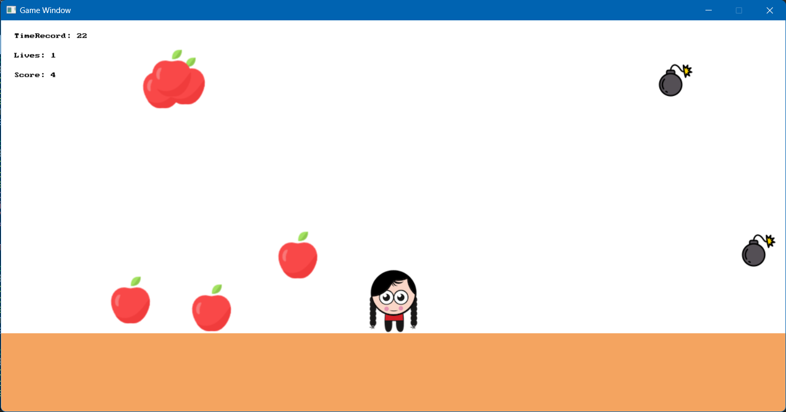
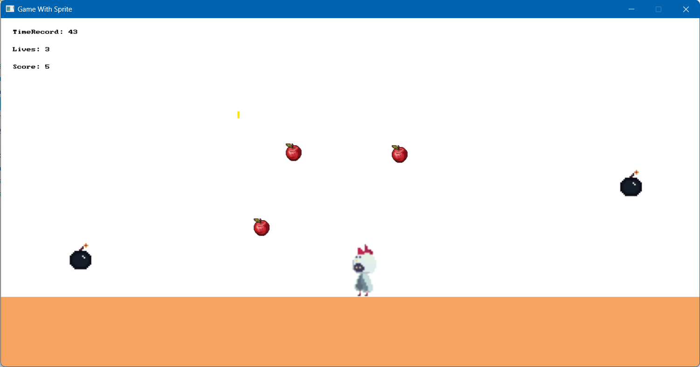

# Programming Tutorials

This repo includes all programming tutorial made by me.

Available tutorials:

1. Making a simple game using C#/.NET and SplashKit: <a href="/SplashKit_Game/">SplashKit - ItemCatch game</a>

    
2. Making an animated game (with Sprite) using C#/.NET and SplashKit: <a href="/SplashKit_SpriteGame/">SplashKit - AnimatedItemCatch game</a>

    